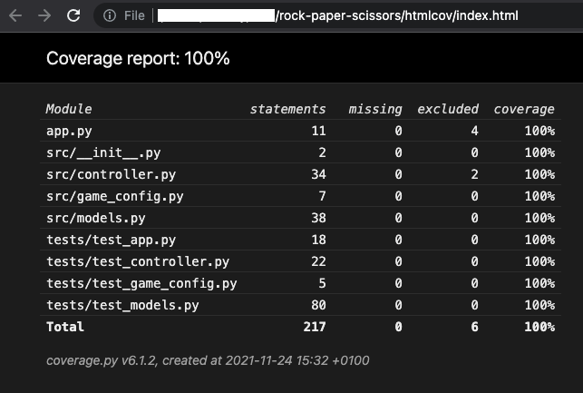
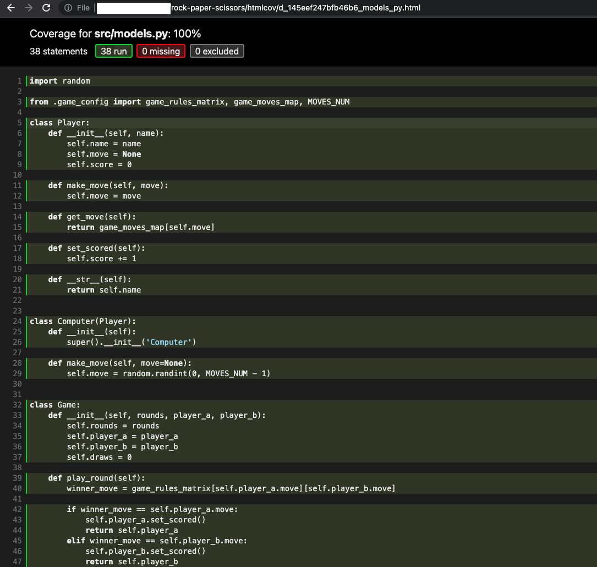

## Paper-Rock-Scissors
### Description

Paper-Rock-Scissors is a game for two players. Each player simultaneously opens his/her hand to display a symbol:
* Fist equals rock
* Open hand equals paper
* Showing the index and middle finger equals scissors.

The winner is determined by the following schema:

* Paper beats (wraps) rock
* Rock beats (blunts) scissors
* Scissors beats (cuts) paper.

Current game plays Paper-Rock-Scissors between the computer and a real player.
A player can play the game n times before the program exits.

### The solution

The solution is based on determing the rules of the games in the form of matrix:

              ro pa sc
        ro [ -1  1  0 ]
    G = pa [  1 -1  2 ]
        sc [  0  2 -1 ]

The non-negative values of the matrix denote the winner of the corresponding inputs. 
Let us take an example:  player 1 chooses scissors (index = 2) and player 2 chooses Paper (index = 1). 
The cells (2, 1) and (1, 2) in the matrix, denote a match between scissors and paper: scissors beats (cuts) paper.

The cells containing '-1' denote a draw game.

Using the matrix the game can be easily re-configured to another game, e.g. to Rock-Paper-Scissors-Lizard-Spock: 


                  ro pa sc li sp
            ro [ -1  1  0  0  4 ]
            pa [  1 -1  2  3  1 ]
    G_EXT = sc [  0  2 -1  2  4 ]
            li [  0  3  2 -1  3 ]
            sp [  4  1  4  3 -1 ]

The extended example is available in the [src/game_config.py][Config]
You can uncomment it and comment out the initial one. (`game_rules_matrix` and `game_moves_map`)

### Requirements

To build this project you will need [Docker][Docker Install].

If you cannot run Docker you can use virtual environment.

### Installation
```bash
$ cd rock-paper-scissors
```
#### Docker
```bash
$ make install
```

If you face issues try docker command directly:

```bash
$ docker build -t rock-paper-scissors .
```

#### Virtualenv

```bash
$ python3 -m venv rps
$ source rps/bin/activate
$ pip install -r requirements.txt
```

### Usage

#### Docker
1. To start the game:
```bash
$ make play-rps ROUNDS=7 NAME=YourName
```
where `ROUNDS` is the number of rounds you want to play and `NAME` is the player's name.
Then you have to enter your choice (rock, paper or scissors) `ROUNDS` times:

```bash
$ Round #1
$ Please enter your move (rock, paper, scissors): rock
```

You'll see the choices of two players and the intermediate result:
```bash
$ Round #6
$ Please enter your move (rock, paper, scissors): rock
$ YourName moved with rock, Computer moved with scissors. 
$ The winner is YourName

```

and the final result after all rounds were played:
```bash
$ YourName:Computer - 3:2, 2 draw(s)
```

#### Virtualenv

```bash
$ python app.py rps-game -r 6 -n YourName
```
All parameters can be entered later, if you omit them:
```bash
rock-paper-scissors % python app.py rps-game              
Rounds [1]: 6
Name: YourName
--------------------------------------------------
```

### Example

```bash
(rps) user@machine rock-paper-scissors % python app.py rps-game
Rounds [1]: 3
Name: YourName
--------------------------------------------------
Round #1
Please enter your move (rock, paper, scissors): rock
YourName moved with rock, Computer moved with scissors. 
The winner is YourName
--------------------------------------------------
Round #2
Please enter your move (rock, paper, scissors): rock
YourName moved with rock, Computer moved with scissors. 
The winner is YourName
--------------------------------------------------
Round #3
Please enter your move (rock, paper, scissors): paper
YourName moved with paper, Computer moved with scissors. 
The winner is Computer
==================================================
YourName:Computer - 2:1, 0 draw(s)
```

### Tests

* To run all tests without coverage
```bash
$ make test-run
```

```bash
coverage run -m unittest discover -s tests
.............
----------------------------------------------------------------------
Ran 13 tests in 0.003s

OK
```

* To tun tests with coverage report:
```bash
$ make test-report
```

```bash
coverage run -m unittest discover -s tests
.............
----------------------------------------------------------------------
Ran 13 tests in 0.003s

OK
coverage report
Name                        Stmts   Miss  Cover
-----------------------------------------------
app.py                         11      0   100%
src/__init__.py                 2      0   100%
src/controller.py              34      0   100%
src/game_config.py              7      0   100%
src/models.py                  38      0   100%
tests/test_app.py              18      0   100%
tests/test_controller.py       22      0   100%
tests/test_game_config.py       5      0   100%
tests/test_models.py           80      0   100%
-----------------------------------------------
TOTAL                         217      0   100%

```

* To create detailed presentation and view it with a browser(opens by the command)
```bash
make coverage-report
```


Clicking on a file you can see details about the coverage:



[Config]: src/game_config.py
[Docker Install]:  https://docs.docker.com/install/